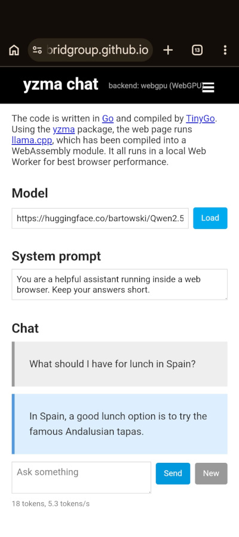

# 100% local chat with a model in your browser using WebAssembly written in Go

[](https://hybridgroup.github.io/yzma-wasm-example)

A chat page that runs the language model completely in the local browser using WebAssembly. There is no server, no API key, and no data goes anywhere. Written in Go using [yzma](https://github.com/hybridgroup/yzma) on [TinyGo](http://tinygo.org).

**<https://hybridgroup.github.io/yzma-wasm-example/>**

### Does it run on mobile? Yes.

[](https://hybridgroup.github.io/yzma-wasm-example)

**<https://hybridgroup.github.io/yzma-wasm-example/>**

## How it works

[](https://github.com/hybridgroup/yzma)

The code is written in Go and compiled by TinyGo. The page uses the
[yzma](https://github.com/hybridgroup/yzma) package to run
[llama.cpp](https://github.com/ggml-org/llama.cpp), which is compiled into a
WebAssembly module. All of it runs in a local Web Worker for the best browser
performance.

```
   index.html
       |  postMessage
   worker.js
     |            \
   yzma.wasm       yzma_wasm*.js
   (Go, TinyGo) -> (llama.cpp, Emscripten)
```

The page keeps no record of the conversation. The conversation stays in the
TinyGo WASM module. Each turn sends the full conversation through the model
again.

## Build and run

You need [TinyGo](https://tinygo.org/getting-started/install/) 0.41 or later, Go
1.26, `jq`, and `node` for the test.

```
make build
make serve
```

Open <http://localhost:8080>, push **Load**, and wait for the download of the
model. The default model is
[Qwen2.5-0.5B-Instruct Q4_K_M](https://huggingface.co/bartowski/Qwen2.5-0.5B-Instruct-GGUF).
It is approximately 400 MB, and the browser caches it. You can use any GGUF URL
if the host sends CORS headers. Hugging Face sends them.

`make build` downloads approximately 14 MB of llama.cpp into `build/`, compiles
the Go program, and copies the page. No binary files are in the repository.

## The test

The test holds a two turn conversation in Node, with no browser. The second
question makes sense only if the first question is still in the prompt. Thus a
sensible answer shows that the chat template is correct.

```
make test MODEL=~/models/Qwen2.5-0.5B-Instruct-Q4_K_M.gguf
```

## Threads and the service worker

llama.cpp has three WebAssembly builds. `yzma-loader.js` selects the best build
that the browser can run.

| Build | What it needs |
| --- | --- |
| `yzma_wasm_webgpu` | WebGPU with f16 shaders, and JSPI. Chrome and Edge 137 and later. |
| `yzma_wasm_mt` | `SharedArrayBuffer`, thus a page with the COOP and COEP headers. |
| `yzma_wasm` | Nothing. It runs everywhere. |

GitHub Pages cannot send the COOP and COEP headers. Without help, the browser
gives the page no `SharedArrayBuffer`, and llama.cpp runs on one thread. In Node
that is the difference between 0.9 and 9.6 tokens a second on Qwen2.5 0.5B.

Thus the page loads
[`coi-serviceworker.js`](https://github.com/gzuidhof/coi-serviceworker) first. It
registers a service worker that adds the two headers and reloads the page once.
After that the page is cross origin isolated, and the loader selects the build
with all of the threads. This also operates on localhost, thus a usual static
server is sufficient for development. `make serve` sets the headers too, which
makes no difference but does no damage.

Cross origin isolation makes it necessary for the model to come from a host that
sends CORS headers. Hugging Face sends them.

The line at the top right of the page shows the selected build. To force a
build, add `?mode=cpu` or `?mode=webgpu` to the URL.

## Notes

- The system prompt box tells the model how to answer. The page sends the prompt
  with each question, thus a change applies to the next answer. An empty box
  gives the default prompt again.
- The model must be smaller than 2 GB. One JavaScript ArrayBuffer holds no more,
  thus a larger model must be in GGUF splits.
- Use a model with a chat template. A base model has no template. The page shows
  a message, but the answers are poor.
- `ChatApplyTemplate` formats one message at a time. Thus `prompt` in `main.go`
  puts the conversation together one message after the other. This is correct
  for a chatml model such as Qwen. It is not fully correct for a model whose
  template puts something one time at the top of a conversation, such as Gemma,
  which folds the system message into the first user turn.
- A discrete NVIDIA card does not give f16 shaders in Chrome. Such a machine
  falls back to the CPU unless you start Chrome with
  `--enable-dawn-features=vulkan_enable_f16_on_nvidia`.

## Deploying

`.github/workflows/pages.yml` builds and deploys on each push to `main`. Set
**Settings → Pages → Source** to **GitHub Actions** one time. That is all.

## License

Apache 2.0, the same as yzma. `web/min.css` ([min](https://mincss.com)) and
`web/coi-serviceworker.js` are MIT, and they keep their own notices.
