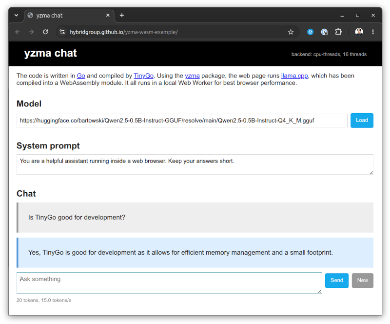

# Local chat with a model in a browser using yzma



A chat page where the whole language model runs in the tab. No server, no API key, nothing sent anywhere.

**<https://hybridgroup.github.io/yzma-wasm-example/>**

## How it works

[](https://github.com/hybridgroup/yzma)

The code is written in Go and compiled by TinyGo. Using the [yzma](https://github.com/hybridgroup/yzma) package, the web page runs [llama.cpp](https://github.com/ggml-org/llama.cpp), which has been compiled into a WebAssembly module. It all runs in a local Web Worker for best browser performance.

```
   index.html
       |  postMessage
   worker.js
     |            \
   yzma.wasm       yzma_wasm*.js
   (Go, TinyGo) -> (llama.cpp, Emscripten)
```

The page stores no record of the conversation. The conversation data is only in the TinyGo WASM module, and each turn puts the whole conversation back through the model.

## Build and run

Needs [TinyGo](https://tinygo.org/getting-started/install/) 0.41 or later, Go
1.26, `jq`, and `node` for the test.

```
make build
make serve
```

Then open <http://localhost:8080>, press **Load**, and wait for the model to come
down. The default is
[Qwen2.5-0.5B-Instruct Q4_K_M](https://huggingface.co/bartowski/Qwen2.5-0.5B-Instruct-GGUF),
about 400 MB, which the browser caches. Any GGUF URL works as long as the host
sends CORS headers, which Hugging Face does.

`make build` downloads about 14 MB of llama.cpp into `build/`, compiles the Go
program, and copies the page. Nothing binary lives in the repo.

## The test

A two turn conversation, in Node, with no browser. The second question only
makes sense if the first one is still in the prompt, so a sensible answer means
the chat template came out right:

```
make test MODEL=~/models/Qwen2.5-0.5B-Instruct-Q4_K_M.gguf
```

## Threads, and why there is a service worker

llama.cpp comes in three WebAssembly builds, and `yzma-loader.js` takes the best
one the browser can run:

| Build | What it needs |
| --- | --- |
| `yzma_wasm_webgpu` | WebGPU with f16 shaders, and JSPI. Chrome and Edge 137 and later. |
| `yzma_wasm_mt` | `SharedArrayBuffer`, so a page with the COOP and COEP headers. |
| `yzma_wasm` | Nothing. It works everywhere. |

GitHub Pages cannot send the COOP and COEP headers, so without help a browser
gives the page no `SharedArrayBuffer` and llama.cpp runs on one thread. In Node
that is the difference between 0.9 and 9.6 tokens a second on Qwen2.5 0.5B.

So the page loads
[`coi-serviceworker.js`](https://github.com/gzuidhof/coi-serviceworker) first.
It registers a service worker that adds the two headers and reloads the page
once, and from then on the page is cross-origin isolated and the loader takes
the build with every thread. It works on localhost too, so a plain static server
is enough for development. `make serve` sets the headers as well, which makes no
difference but does no harm.

Cross-origin isolation does mean a model has to come from a host that sends CORS
headers. Hugging Face does.

The line at the top right of the page says which build won. Force one with
`?mode=cpu` or `?mode=webgpu` on the URL.

## Notes

- The system prompt box tells the model how to answer. The page sends it with
  each question, so a change applies to the next answer. An empty box gives the
  default prompt back.
- The model has to be smaller than 2 GB. One JavaScript ArrayBuffer holds no
  more, so anything larger has to be in GGUF splits.
- Use a model with a chat template. A base model has none, and the page says so,
  but the answers wander.
- `ChatApplyTemplate` formats one message at a time, so `prompt` in `main.go`
  puts the conversation together one message after another. That is exactly
  right for a chatml model such as Qwen. A model whose template puts something
  once at the top of a conversation, such as Gemma folding the system message
  into the first user turn, comes out slightly off.
- A discrete NVIDIA card does not give f16 shaders in Chrome, so such a machine
  falls back to the CPU unless Chrome starts with
  `--enable-dawn-features=vulkan_enable_f16_on_nvidia`.

## Deploying

`.github/workflows/pages.yml` builds and deploys on every push to `main`. Set
**Settings → Pages → Source** to **GitHub Actions** once, and that is all.

## License

Apache 2.0, the same as yzma. `web/min.css`
([min](https://mincss.com)) and `web/coi-serviceworker.js` are MIT, and keep
their own notices.
