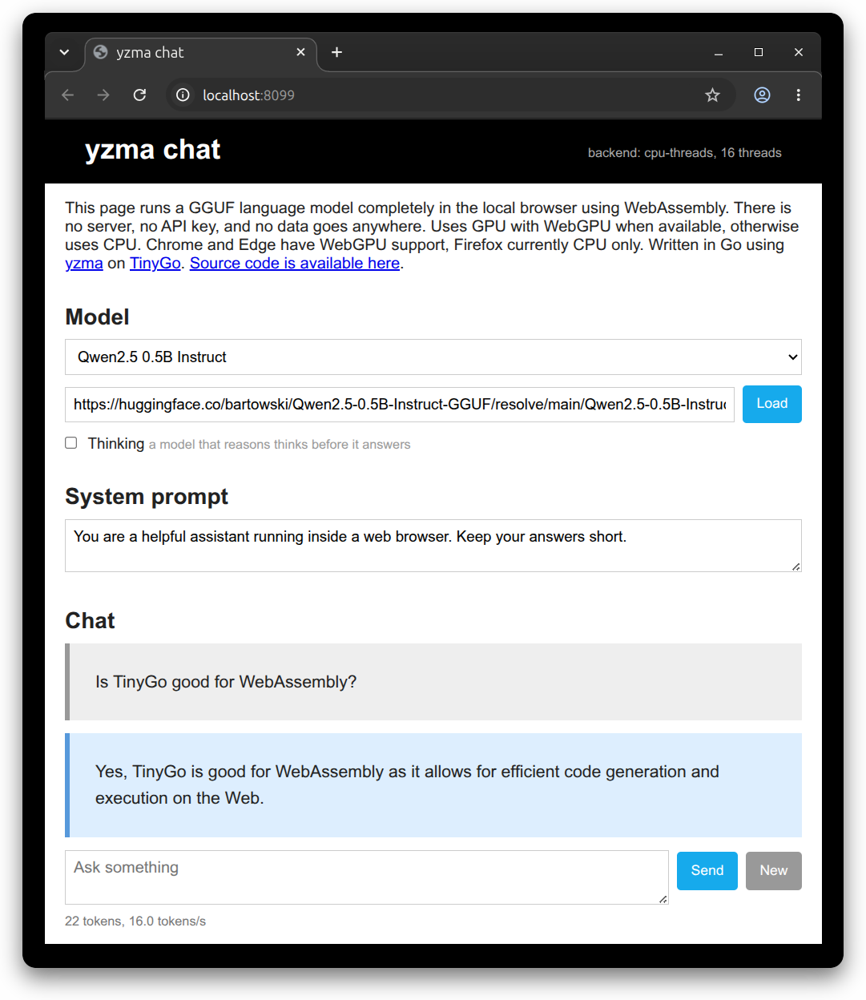
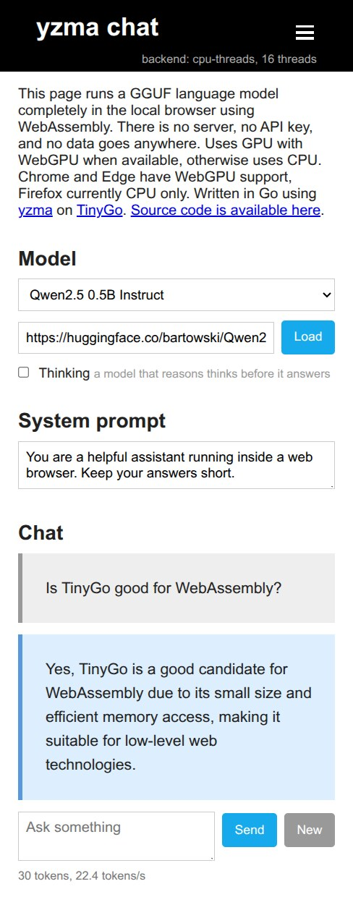

# 100% local chat with a model in your browser using WebAssembly written in Go

[](https://hybridgroup.github.io/yzma-wasm-example)

A chat page that runs a GGUF language model entirely in your browser using WebAssembly. There is no server, no API key, and no data leaves your machine. It uses the GPU through WebGPU when available, otherwise the CPU. Chrome and Edge support WebGPU, Firefox currently runs on the CPU only. Written in Go using [yzma](https://github.com/hybridgroup/yzma) on [TinyGo](http://tinygo.org).

**<https://hybridgroup.github.io/yzma-wasm-example/>**

### Does it run on mobile? Yes.

[](https://hybridgroup.github.io/yzma-wasm-example)

**<https://hybridgroup.github.io/yzma-wasm-example/>**

## How it works

[](https://github.com/hybridgroup/yzma)

The code is written in Go and compiled with TinyGo. It uses the
[yzma](https://github.com/hybridgroup/yzma) package to run
[llama.cpp](https://github.com/ggml-org/llama.cpp), compiled to a WebAssembly
module. Everything runs in a Web Worker so the page stays responsive.

```
   index.html
       |  postMessage
   worker.js
     |            \
   yzma.wasm       yzma_wasm*.js
   (Go, TinyGo) -> (llama.cpp, Emscripten)
```

The page does not store the conversation. It lives in the TinyGo WASM module,
and each turn sends the full conversation through the model again.

## Build and run

You need [TinyGo](https://tinygo.org/getting-started/install/) 0.41 or later, Go
1.26, and `node` for the test.

```
make build
make serve
```

Open <http://localhost:8080>, click **Load**, and wait for the model to
download. The browser caches it.

The list has four small models to start with.

| Model | Size | Thinking |
| --- | --- | --- |
| [Qwen2.5 0.5B Instruct](https://huggingface.co/bartowski/Qwen2.5-0.5B-Instruct-GGUF) | approximately 380 MB | no |
| [LFM2.5 350M](https://huggingface.co/LiquidAI/LFM2.5-350M-GGUF) | approximately 220 MB | no |
| [Qwen3.5 0.8B](https://huggingface.co/unsloth/Qwen3.5-0.8B-GGUF) | approximately 510 MB | yes |
| [Gemma 3 1B Heretic Uncensored Thinking](https://huggingface.co/Andycurrent/Gemma-3-1B-it-GLM-4.7-Flash-Heretic-Uncensored-Thinking_GGUF) | approximately 770 MB | no |

Choose **Another URL** to enter your own. Any GGUF URL works if the host sends
CORS headers. Hugging Face does.

`make build` downloads about 13 MB of llama.cpp into `build/`, compiles the Go
program, and copies the page. The repository has no binary files.

The download comes from
[llama-cpp-builder](https://github.com/hybridgroup/llama-cpp-builder). It uses
v0.5.0, the release that yzma v1.28.0 installs. To use another build, pass its
tag, or `latest` for the newest nightly build.

```
make build LLAMA_VERSION=latest
```

## The test

The test runs a two turn conversation in Node, without a browser. The second
question only makes sense if the first one is still in the prompt, so a sensible
answer shows that the chat template is correct.

```
make test MODEL=~/models/Qwen2.5-0.5B-Instruct-Q4_K_M.gguf
```

Add `--think` to let a reasoning model think before it answers.

```
node test/chat.js --dir build --model ~/models/Qwen3.5-0.8B-Q4_K_M.gguf --mt --think
```

## WebGPU, threads, and the service worker

llama.cpp has three WebAssembly builds. `yzma-loader.js` picks the best one the
browser can run.

| Build | What it needs |
| --- | --- |
| `yzma_wasm_webgpu` | WebGPU with f16 shaders, and JSPI. Chrome and Edge 137 or later, or Firefox 153 or later with two switches. |
| `yzma_wasm_mt` | `SharedArrayBuffer`, so a page with the COOP and COEP headers. |
| `yzma_wasm` | Nothing. It runs everywhere. |

The WebGPU build runs on the GPU and is the fastest of the three. It needs an
adapter with `shader-f16` and JSPI, so a browser can have WebGPU while llama.cpp
still has no device. In that case the loader falls back to the CPU, because a
slow page is better than one that does not run.

GitHub Pages cannot send the COOP and COEP headers. Without them the browser
does not expose `SharedArrayBuffer`, and llama.cpp runs on one thread. In Node
that is the difference between 0.9 and 9.6 tokens per second on Qwen2.5 0.5B.

So the page loads
[`coi-serviceworker.js`](https://github.com/gzuidhof/coi-serviceworker) first. It
registers a service worker that adds the two headers and reloads the page once.
After that the page is cross origin isolated, and the loader picks the
multithreaded build. This also works on localhost, so any static server is fine
for development. `make serve` sets the headers too, which is redundant but
harmless.

With cross origin isolation the model must come from a host that sends CORS
headers. Hugging Face does.

The top right of the page shows the selected build. To force a build, add
`?mode=cpu` or `?mode=webgpu` to the URL. With `?mode=webgpu`, the worker console
reports what is missing when the loader falls back to the CPU.

`?embed` hides the paragraph at the top of the page. A page that embeds this one
in a frame, such as [yzma.ai/try/](https://yzma.ai/try/), has its own text
around the frame and does not need ours.

### Firefox

Firefox can run the WebGPU build. WebGPU is not on by default yet, so set both
of these in `about:config` and restart the browser.

| Switch | Why |
| --- | --- |
| `dom.webgpu.enabled` | WebGPU on Linux is still behind this switch. |
| `dom.webgpu.workers.enabled` | llama.cpp loads in a worker, so WebGPU in the page alone is not enough. |

JSPI arrived in Firefox 153, so 153 or later needs no switch for it. With the
two switches set, Firefox 153 or later shows `backend: webgpu` on the page.

Firefox returns an empty `adapter.info`, so the page shows just `webgpu` with no
card name. This is not an error. Firefox also has no subgroups, so llama.cpp
uses the plain f16 shaders and the same card is slower than in Chrome.

The two CPU builds run in Firefox without any switches.

## Notes

- **Thinking** lets a reasoning model think before it answers. The page shows
  the thoughts in a collapsible block and keeps them out of the conversation,
  because the model template drops the thoughts of earlier turns. Choosing a
  model from the list sets the checkbox for you, on for reasoning models and
  off for the others.
- The checkbox does nothing for a model that does not reason. `main.go` checks
  whether the model chat template supports thinking and ignores the checkbox
  when it does not. With the checkbox on, the prompt ends with an open thinking
  block. With it off, the prompt ends with an empty block, which tells the model
  to answer right away. Some templates, such as Qwen3, write the empty block
  themselves, so `main.go` removes that one first.
- The Gemma model in the list has the plain Gemma template in its GGUF, which
  does not support thinking. The checkbox does nothing for it, even though the
  model name says thinking.
- The system prompt tells the model how to answer. The page sends it with each
  question, so a change applies to the next answer. An empty box restores the
  default prompt.
- The model must be smaller than 2 GB, the limit of one JavaScript ArrayBuffer.
  A larger model must be split into GGUF parts.
- Use a model with a chat template. A base model has none. The page shows a
  warning, but the answers are poor.
- `ChatApplyTemplate` formats one message at a time, so `prompt` in `main.go`
  builds the conversation message by message. This is correct for a chatml
  model such as Qwen. It is not fully correct for a model whose template adds
  something once at the start of a conversation, such as Gemma, which folds the
  system message into the first user turn.
- Discrete NVIDIA cards do not expose f16 shaders in Chrome. Such a machine
  falls back to the CPU unless you start Chrome with
  `--enable-dawn-features=vulkan_enable_f16_on_nvidia`.
- Firefox uses wgpu and Chrome uses Dawn, so the two do not always pick the same
  adapter or report the same features on one machine. On a machine with two
  cards, `__NV_PRIME_RENDER_OFFLOAD=1 __GLX_VENDOR_LIBRARY_NAME=nvidia firefox`
  or `MESA_VK_DEVICE_SELECT=<vendor>:<device> firefox` selects the card.
- The [yzma WebAssembly guide](https://github.com/hybridgroup/yzma/blob/main/wasm/README.md)
  has more on the backends, the browsers, and how fast each one is.

## Deploying

`.github/workflows/pages.yml` builds and deploys on each push to `main`. Set
**Settings → Pages → Source** to **GitHub Actions** once. That is all.

`.github/workflows/assets.yml` also builds the page and uploads it to the `demo`
release as `demo.tar.gz`. The file URL does not change:

```
https://github.com/hybridgroup/yzma-wasm-example/releases/download/demo/demo.tar.gz
```

[yzma.ai](https://yzma.ai/try/) fetches this tarball each time the site builds.
The last workflow step triggers a site build through a Netlify build hook. Put
the hook URL in the `NETLIFY_BUILD_HOOK` secret. Without the secret the workflow
skips that step, and the site picks up the new build on its next rebuild.

## License

Apache 2.0, the same as yzma. `web/min.css` ([min](https://mincss.com)) and
`web/coi-serviceworker.js` are MIT, and they keep their own notices.
